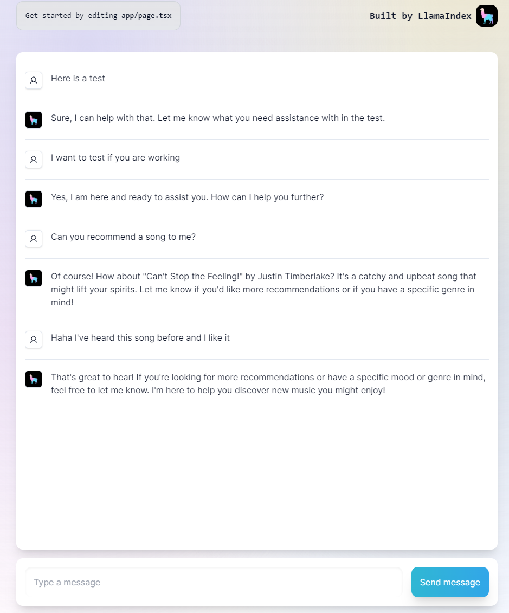

# Chatbot Web Application with GPT API and RAG Tags

This repository contains a full-stack chatbot web application that integrates GPT (Generative Pre-trained Transformer) API and RAG (Retrieval Augmented Generation) tags for enhanced conversational experiences. The application is designed to be run either as a frontend or a backend server. To start the frontend or backend, simply execute `npm run dev` in the respective folder.

## Demo

Currently working on deployment, since the model seems to be too big, every time when I try to deploy it on vercel, it crashes when I'm asking it something. It works fine locally.



## Features

- **GPT API Integration**: Utilizes GPT API for generating responses to user queries.
- **RAG Tags**: Enhances conversational responses using RAG tags for better contextual understanding.
- **Full-Stack Implementation**: Includes both frontend and backend components for seamless interaction.
- **Scalable Architecture**: Built with scalability in mind to accommodate growing user bases.
- **Easy Deployment**: Simple deployment process with npm scripts for frontend and backend setup.

## Requirements

- Node.js
- npm

## Installation

1. Clone this repository:

   ```bash
   git clone https://github.com/MRSA-J/ChatBot.git
   ```

2. Navigate to the `frontend` and `backend` folder and `run dev`:

   ```bash
   cd frontend  # or cd backend
   npm install # install dependencies
   ```

3. Create a `.env` file individually for `frontend` and `backend`
   ```.env 
    # frontend
    NEXT_PUBLIC_CHAT_API=http://localhost:8000/api/chat
   ```

    In backend folder:
   ```.env 
    # backend
    OPENAI_API_KEY=your_openai_api_key
   ```


## Usage

### Frontend

To run the frontend server:

```bash
npm run dev
```

Visit `http://localhost:3001` in your web browser to interact with the chatbot.

### Backend

To run the backend server:

```bash
npm run dev
```

The backend server will be hosted at `http://localhost:8000`.

## Configuration

- **GPT API Token**: You need to obtain an API token from GPT API provider and configure it in the appropriate environment variables or configuration files.


## License

This project is licensed under the [MIT License](LICENSE).
